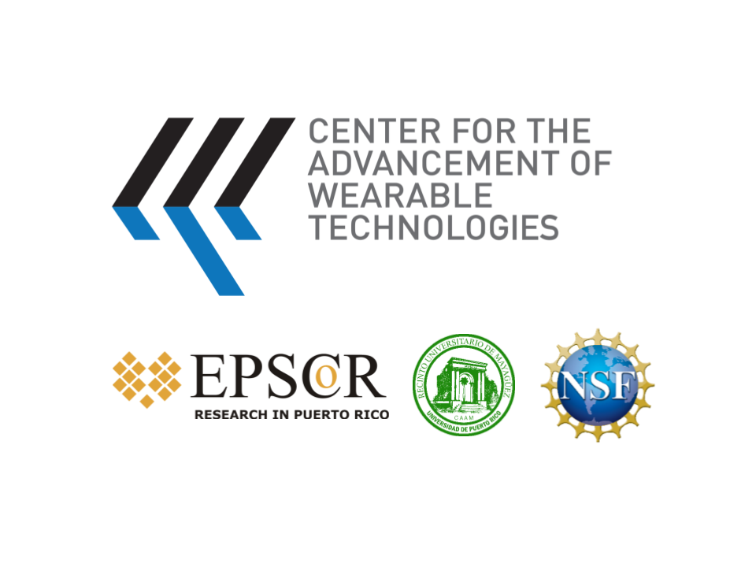

**This work is sponsor by _CENTER FOR THE ADVANCEMENT OF WEARABLE TECHNOLOGIES_.**



_This repository provides some examples of how to use dataframe, particularly how to load data from HDFS
and save data to HDFS._

To run these examples, you need to create a Cloud Platform with HDFS and Spark. You can download my HDFS and Spark installation that are available at [HDFS repository](https://github.com/CarlosTheran/Hadoop.git) and [Spark repository](https://github.com/CarlosTheran/Spark.git).

The cluster has the following configuration.
* masternode
* 4 datanode
* 4 workers
* 1 clientnode

In this repository you will find a csv file. This file was downloaded from [covi-19 dataset](https://data.europa.eu/euodp/en/data/dataset/covid-19-coronavirus-data). Now, to start working with these examples you need to

1. start all services from masternode
```bash
masternode@vm:~# start-dfs.sh
masternode@vm:~# start-yarn.sh
masternode@vm:~# $SPARK_HOME/sbin/start-all.sh
```
2. create a new folder on HDFS and upload the csv file to that folder
```bash
clientnode@vm:~# hdfs dfs -mkdir /covi
clientnode@vm:~# hdfs dfs -put csv_covi19 /covi/
```
3. run Spark in yarn cluster mode using pyspark if you want to interact with the shell

```bash
clientnode@vm:~# pyspark --master yarn
```
4. If you want to run the python code you must to submit the job as follow.
```bash
clientnode@vm:~# spark-submit --master yarn --deploy-mode client <py filename>
```

